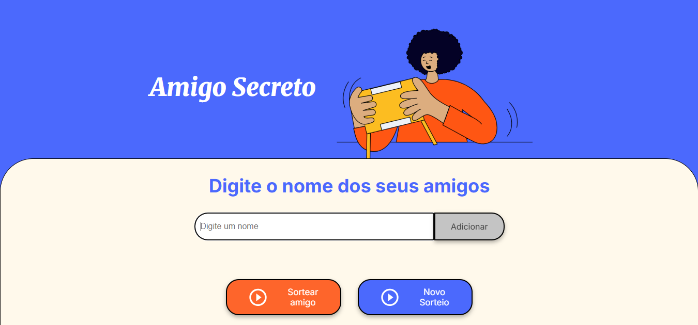

# Sorteador de Amigo Secreto 🎁

 

Link do projeto: https://sorteador-amigo-secreto-eta.vercel.app/

## Descrição

Este é um projeto simples e funcional de um sorteador de "Amigo Secreto", desenvolvido como parte de um estudo prático de lógica de programação com JavaScript. A aplicação permite adicionar participantes, sortear um nome por vez sem repetição e reiniciar o sorteio.

## Funcionalidades

* **Adicionar Amigos:** Permite inserir nomes na lista de participantes.
* **Validação de Entrada:** Impede a adição de nomes vazios.
* **Sorteio Progressivo:** Sorteia um participante por vez, garantindo que ninguém seja sorteado duas vezes na mesma rodada.
* **Reiniciar Sorteio:** Um botão para limpar todos os dados e começar um novo sorteio do zero.
* **Interface Limpa:** Foco na usabilidade com feedback claro para o usuário.

## Tecnologias Utilizadas

O projeto foi construído utilizando as seguintes tecnologias web:

* **HTML5:** Para a estrutura semântica do conteúdo.
* **CSS3:** Para a estilização e o design da interface.
* **JavaScript:** Para toda a lógica de programação, manipulação de eventos e interatividade.
